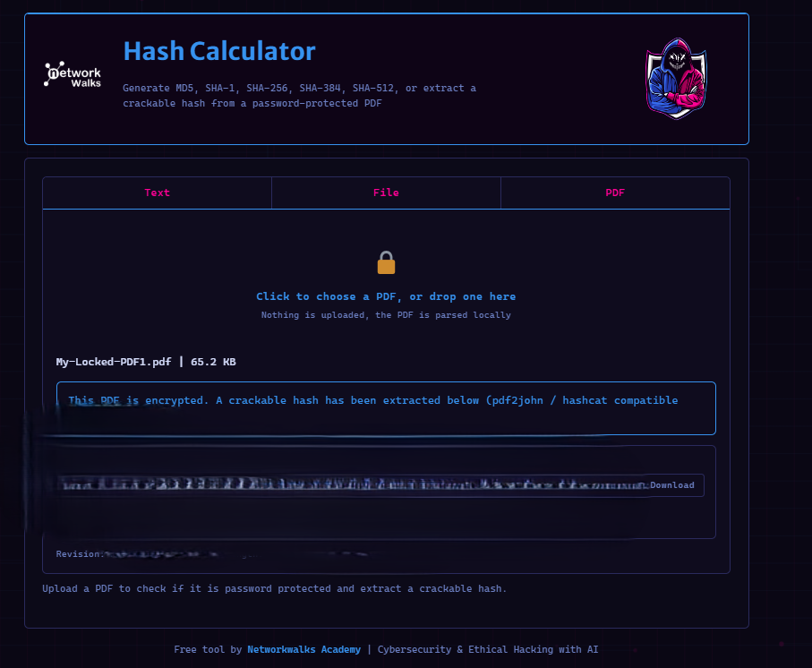
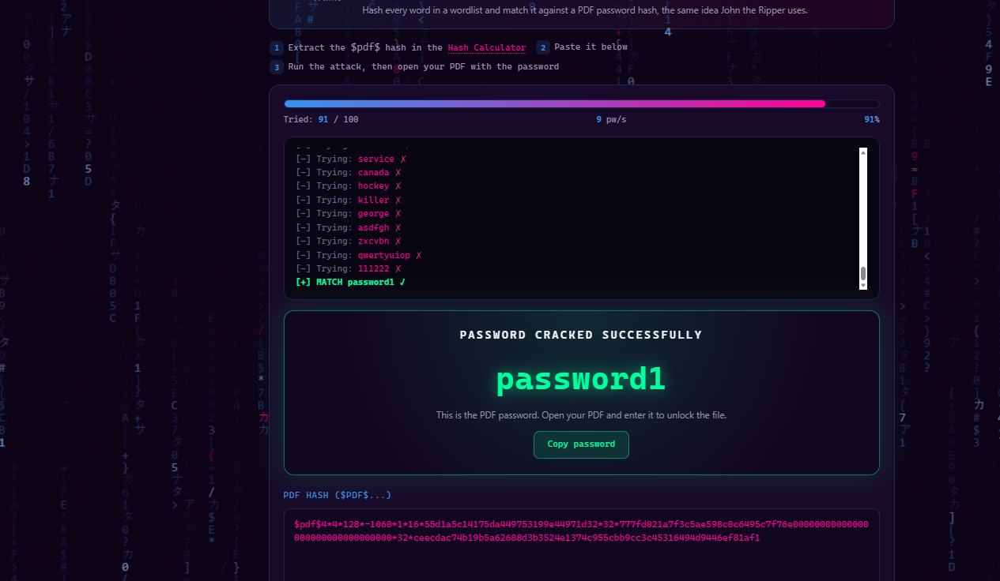

# 🔐 Week 3 Cybersecurity Project - Password Security

## 👤 Intern Details

**Name:** Lubanzi Fihla  
**Batch:** B083  
**Program:** NetworkWalks Cybersecurity Internship  
**Week:** Week 3

---

## 📌 Project Overview

Week 3 focused on understanding password security and password recovery techniques within an authorized cybersecurity training environment.

The project consisted of two essential modules:

- **W3-PM1:** Password Cracking with John the Ripper (JTR)
- **W3-PM2:** Password Cracking with NetworkWalks Tools

All password recovery activities documented in this repository were performed against training files supplied specifically for the NetworkWalks cybersecurity lab.

---

# 🛠️ Tools Used

- Kali Linux
- John the Ripper (JTR)
- pdf2john
- NetworkWalks Hash Calculator
- NetworkWalks Password Cracker
- Oracle VirtualBox
- GitHub

---

# 🔹 W3-PM1: Password Cracking with John the Ripper

## Objective

The objective of this module was to understand how password-protected PDF files can be assessed using John the Ripper in an authorized cybersecurity lab.

The exercise involved:

1. Verifying John the Ripper on Kali Linux.
2. Transferring the supplied training PDF into Kali Linux.
3. Extracting the PDF password hash.
4. Saving the extracted hash.
5. Processing the hash using John the Ripper.
6. Verifying that the password recovery exercise completed successfully.

---

## 1. John the Ripper Setup

I first confirmed that John the Ripper was installed and working correctly on Kali Linux.

Command used:

```bash
john --help
```

The command confirmed that John the Ripper was available and ready to use.

### 📸 Evidence

https://github.com/Lubanzi-Fihla/NETWORKWALKS-B083-WK3-PASSWORD-CRACKING/blob/main/screenshots/PM1-01-John-The-Ripper.png

---

## 2. PDF Hash Extraction

The NetworkWalks supplied password-protected PDF was transferred into my Kali Linux environment.

I then used `pdf2john` to extract the password hash from the PDF.

Command used:

```bash
pdf2john My-Locked-PDF1.pdf > hash1.txt
```

I verified that the hash file had been created using:

```bash
ls
```

This produced:

```text
My-Locked-PDF1.pdf
hash1.txt
```

### 📸 Evidence

screenshots/PM1-02-PDF-Hash-Extracted.png

---

## 3. John the Ripper Password Recovery

The extracted PDF hash was processed using John the Ripper.

Command used:

```bash
john hash1.txt
```

After the process completed, I verified the result using:

```bash
john --show hash1.txt
```

John reported:

```text
1 password hash cracked, 0 left
```

This confirmed that the password recovery exercise had completed successfully.

### 📸 Evidence

screenshots/PM1-03-JTR-Password-Recovered.png

---

# 🔹 W3-PM2: Password Cracking with NetworkWalks Tools

## Objective

The objective of this module was to understand the password recovery process using the browser-based cybersecurity training tools supplied by NetworkWalks.

The exercise involved:

1. Uploading the supplied password-protected PDF to the Hash Calculator.
2. Extracting the PDF password hash.
3. Copying the extracted hash.
4. Processing the hash using the NetworkWalks Password Cracker.
5. Recovering the training password.
6. Verifying the result by successfully opening the supplied PDF.

---

## 1. NetworkWalks Hash Calculator

The supplied password-protected training PDF was uploaded to the NetworkWalks Hash Calculator.

The tool successfully detected the encrypted PDF and extracted the PDF password hash required for the next stage of the exercise.

#### 📸 Evidence



---
## 2. NetworkWalks Password Recovery

The extracted PDF hash was copied into the NetworkWalks Password Cracker.

The built-in training password list was used during the authorized exercise.

The password recovery process completed successfully, demonstrating how weak or predictable passwords can be recovered using dictionary-based password testing.

### 📸 Evidence


---

## 3. PDF Verification

After the training password was successfully recovered, I used the recovered credential to open the supplied password-protected PDF.

The PDF opened successfully, confirming that the password recovery process had worked correctly.

### 📸 Evidence
https://github.com/Lubanzi-Fihla/NETWORKWALKS-B083-WK3-PASSWORD-CRACKING/tree/main


---

# 🧠 What I Learned

This Week 3 project strengthened my understanding of:

- Password security
- Password-protected file formats
- Password hashing concepts
- Dictionary-based password recovery
- John the Ripper
- pdf2john
- Kali Linux
- Password strength
- Cybersecurity lab documentation
- Ethical use of password auditing tools

One of the most important lessons from this project was understanding why short, common and predictable passwords present a security risk.

The practical exercises also helped me understand the relationship between a protected file, its password hash, a password dictionary and the password recovery process.

---

# 🚧 Challenges and Troubleshooting

During the project, one challenge was transferring the supplied PDF file from my Windows host computer into the Kali Linux virtual machine.

I resolved this by creating a VirtualBox Shared Folder called:

```text
KaliShare
```

The shared folder became available in Kali at:

```text
/media/sf_KaliShare
```

I verified the supplied PDF using:

```bash
ls /media/sf_KaliShare
```

and then copied the training PDF into the Kali Downloads directory.

This troubleshooting process helped strengthen my understanding of VirtualBox shared folders and file management between host and guest 
